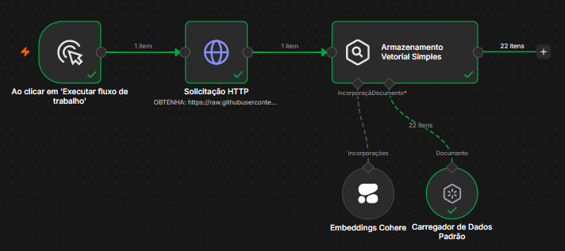
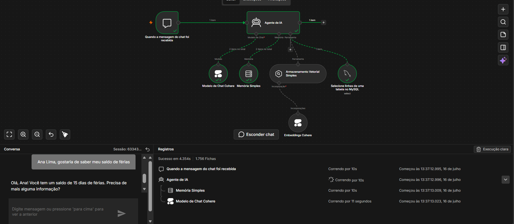
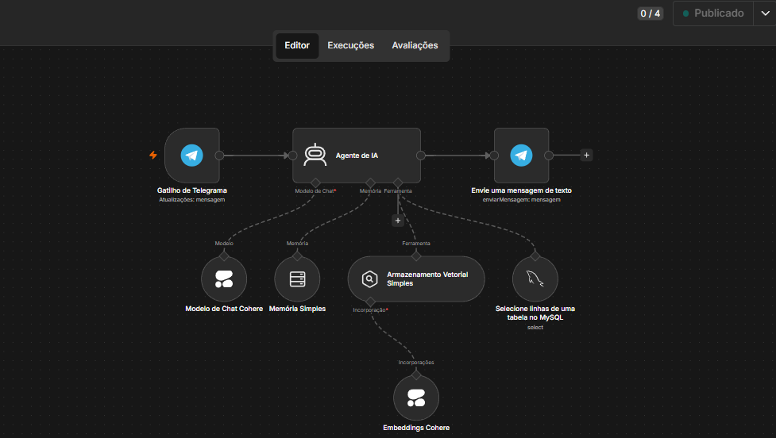

# 🤖 Ecossistema de Agentes de IA com RAG, SQL e Telegram (n8n)

Este repositório contém um ecossistema completo de automação e Inteligência Artificial desenvolvido no **n8n**. O projeto implementa técnicas de **RAG (Retrieval-Augmented Generation)** com banco de dados vetorial, consultas dinâmicas em banco relacional (**MySQL**) e entrega uma interface final ativa para usuários através do **Telegram**.

O sistema é modular e dividido em 3 fluxos complementares que cobrem desde a ingestão de dados até o ambiente de produção.

---

## 🏗️ Arquitetura do Sistema

O projeto foi estruturado em três etapas principais:

### 1. Pipeline de Memória Semântica e Ingestão de Dados
O fluxo `estrutura_memoria_semantica` é responsável por extrair documentos externos através de requisições HTTP, gerar embeddings de alta dimensão utilizando o modelo da **Cohere** e armazená-los de forma estruturada em uma memória vetorial (*Vector Store*).

  

### 2. Interface de Chat para Validação e Integração de Dados
O fluxo `integracao_bancodedados` serve como playground de testes e homologação do agente. Ele disponibiliza uma interface de chat onde o modelo **Cohere** atua como um agente inteligente munido de duas ferramentas principais para resolver queries complexas:
*   **Recuperação Vetorial:** Consulta os documentos semânticos indexados no passo anterior.
*   **Consulta Relacional (MySQL):** Executa comandos `SELECT` em tempo real para extrair dados estruturados diretamente de tabelas do banco de dados relacional.

  

### 3. Agente de Produção no Telegram
O fluxo `fluxo_producao` transfere as capacidades testadas para o ambiente real de produção. Utilizando o gatilho oficial do **Telegram**, o agente recebe as interações dos usuários, gerencia o histórico e contexto da conversa utilizando memória simples e responde de forma automatizada e inteligente.

  

---

## 📽️ Demonstração em Execução

Veja abaixo o comportamento prático do agente inteligente interagindo com o usuário:

  

---

## 🛠️ Tecnologias e Ferramentas Utilizadas

*   **n8n:** Orquestrador visual de fluxos de automação e modelagem de agentes inteligentes baseados em nós.
*   **Cohere API:** Processamento de linguagem natural (LLM) para o chat e geração de embeddings para a busca semântica.
*   **MySQL Database:** Banco de dados relacional que atua como fonte de verdade estruturada acessível pelo agente.
*   **Vector Store & Semantic Memory:** Armazenamento vetorial para recuperar contexto rico antes de enviar o prompt ao LLM (padrão RAG).
*   **Telegram Bot API:** Interface de ponta a ponta (frontend de mensageria) integrado via webhook.

 

  
  
  
  

---

## 🚀 Como Executar e Importar os Fluxos

Para reproduzir este ecossistema na sua própria instância do n8n:

1.  **Baixe os arquivos de fluxo** localizados na pasta [fluxos/](fluxos/):
    *   `estrutura_memoria_semantica.json`
    *   `integracao_bancodedados.json`
    *   `fluxo_producao.json`
2.  No seu painel do n8n, crie um novo fluxo de trabalho (*Workflow*).
3.  Clique nos três pontinhos (`...`) no canto superior direito do editor e selecione **Import from File** (Importar de arquivo).
4.  Selecione o arquivo `.json` correspondente.
5.  Configure e valide suas credenciais para:
    *   *Cohere API Key*
    *   *MySQL Connection parameters*
    *   *Telegram Bot Token*
6.  Ative os fluxos clicando no botão **Publicado/Active** para iniciar as automações!
